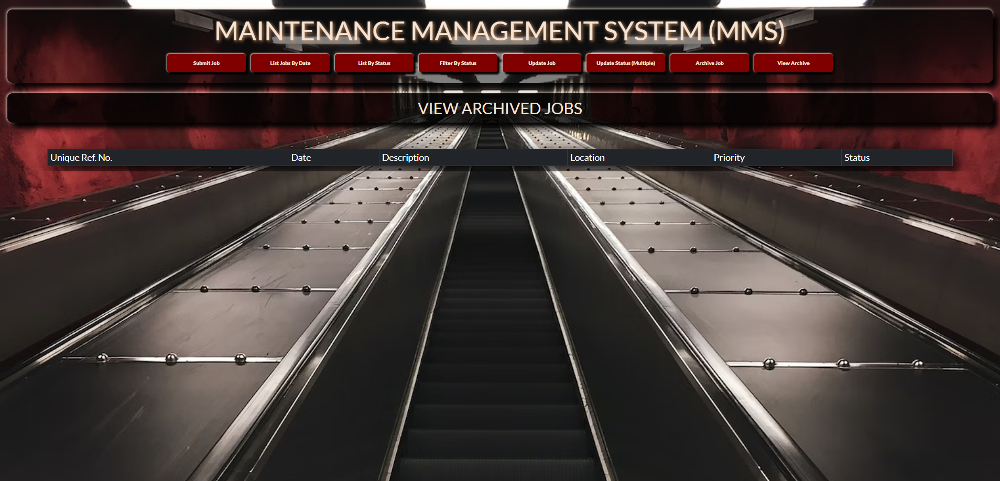

# Maintenance Management System (MMS) - v1.0.0

## Index

1. Introduction / About
2. Installation
3. Usage
4. Author and Versioning

## Introduction / About

This is a ful stack MERN application that simulates a maintenance task management system.  The code base is split into a backend that interfaces with the MongoDB database and a React frontend.  

The project was coded as part of a boot camp and as an exercise in the deployment of a full MERN stack application.  

This project was bootstrapped with [Create React App](https://github.com/facebook/create-react-app).

## Installation

To install the project clone or download the code and then run the command `yarn install` or `npm install` in both the frontend and backend directories.   

## Usage

To start the application simply enter the commands `yarn start` or `npm start` in both the frontend and backend directories. This will start a React development server on the frontend and a server on the backend. It will also establish a connection with your MongoDB database on the backend.

In order to connect to your MongoDB database you will need a `.env` file in the backend root directory with a variable called MONGODB_CONNECTION_STRING which is set equal to your own connection string. The database infrastructure was set up with MongoDB Atlas in mind and not a local instance. 

Once this has been done the application has a very user-friendly and intuitive user interface with buttons linking to the different options in a header that appears on each page of the application.  

The following screenshots were taken using a blank database just to give an idea of what the application offers.  

### Landing / Home Page

### Submit New Job

### List Jobs By Date

### List Jobs by Status

### Filter By Status

### Update Jobs
Each job will have a update button next to it which will lead to a update form where all fields can be edited except for the unique reference number.

### Update Status (Multiple)
Each job will have a drop down menu next to it to change the status. The bulk update button visible on this screenshot will trigger a bulk update.

### Archive Jobs
Each job will have an archive button next to it.

### View Archived Jobs

All in all a very user friendly application.

## Author and Versioning

This application was designed and programmed by Johann Jansen van Vuuren. The current version v1.0.0 was released on 17 May 2023.  

